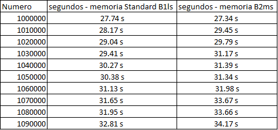
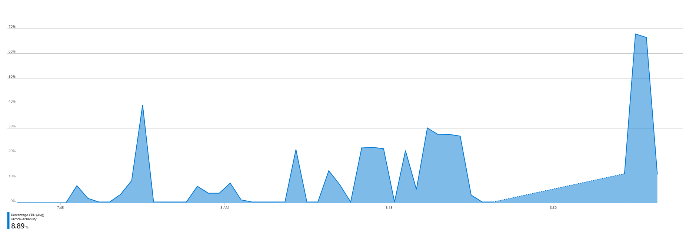
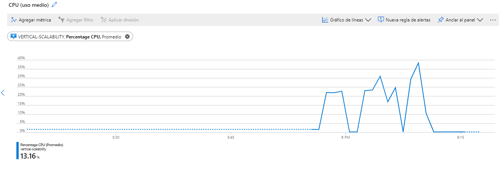
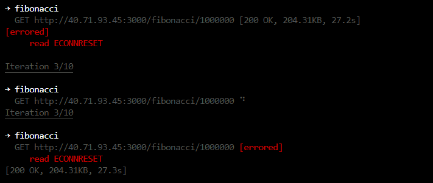
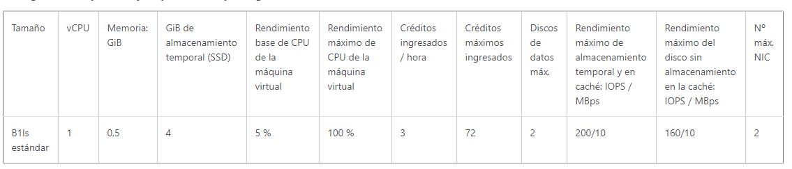
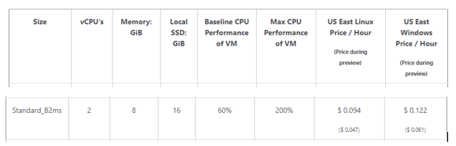
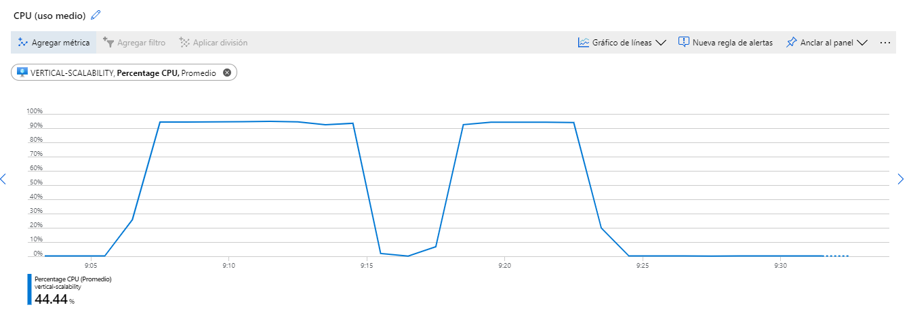
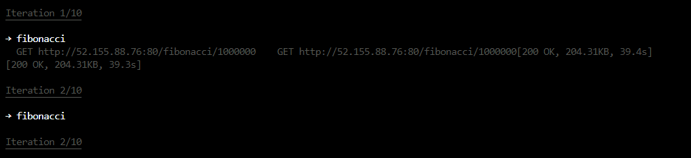

# Escalamiento en Azure con Maquinas Virtuales, Sacale Sets y Service Plans

# Primera parte 

## 1. ¿Cuántos y cuáles recursos crea Azure junto con la VM?

Cuando se crea una maquina una virtual en azure, se crean en total 7 recursos incluyendo la maquina virtual. los cuales son: 

- Una red virtual 
- Cuenta de almacenamiento 
- Direccion IP publica 
- Grupo de seguridad de red 
- Interfaz de red 
- Disco 
- Maquina virtual 

## 2. ¿Brevemente describa para qué sirve cada recurso?

### Red virtual (vnet) 

Es el bloque de creacion fundamental de una red privada en azure, permite a muchos tipos de recursos, tal como una maquina virtual, comunicarse entre 
usuarios, con redes locales e internet de forma segura. Es similar a una red tradicional pero le aporta las ventajas adicionales de la infraestructura cloud 
como escalabilidad, disponibilidad y aislamiento. 

### Cuenta de almacenamiento (storage account)

Se encarga de contener todos los objetos de almacenamiento ofrecidos por azure: archivos, colas, blobs, discos etc. la cuenta de almacenamiento provee un 
espacio de nombre unico para la informacion alojada, la cual es accesible desde cualquier parte del mundo a traves de HTTP o HTTPS.  

### Direccion IP publica

La direccion IP que tendra la maquina, la cual la hace accesible desde cualquier parte del mundo. 

### Grupo de seguridad de red

Un grupo de seguridad de red contiene reglas de seguridad que permiten o deniegan el tráfico de red entrante 
o el tráfico de red saliente de varios tipos de recursos de Azure.

### Interfaz de red 

Una interfaz de red permite que una máquina virtual de Azure se comunique con los recursos de Internet, Azure y locales. 
Al crear una máquina virtual desde Azure Portal, este crea una interfaz de red con la configuración predeterminada.

### Disco 

Se puede considerar como un disco físico en un servidor en el entorno local, pero virtualizado. Los discos administrados de Azure se 
almacenan como blobs en páginas, que son un objeto de almacenamiento de E/S aleatorio en Azure. Llamamos a administrados a estos discos
porque es una abstracción sobre los blobs en páginas, los contenedores de blobs y las cuentas de almacenamiento de Azure. Con los discos
administrados, lo único que debe hacer es aprovisionar el disco y Azure se encarga del resto.

## 3. ¿Al cerrar la conexión ssh con la VM, por qué se cae la aplicación que ejecutamos con el comando npm FibonacciApp.js? ¿Por qué debemos crear un Inbound port rule antes de acceder al servicio?

- La aplicacion se cae debido a que el proceso termina su ejecucion cuando la conexion ssh se cierra. 
- Esta normas son las encargadas de permitir o denegar el trafico de red, por defecto el puerto de la aplicacion no esta definido en estas normas por lo tanto el acceso es denegado, para esto se debe crear la regla, que permita el acceso desde el exterior a el puerto. 

## 4. Adjunte tabla de tiempos e interprete por qué la función tarda tando tiempo.

Se tomaron los tiempos de respuesta con un tamano Standard B1ls y un tamano B2ms. 

### tabla 

La funcion tarda debido a la forma en la que esta implementada internamente, ya que al cambiar el tamano los tiempos no cambian de manera 
drastica pero si cambia el consumo de CPU, de lo cual se concluye que no importa el tamano que se elija el tiempo que tarde no va a variar considerablemente.

## 5. Adjunte imágen del consumo de CPU de la VM e interprete por qué la función consume esa cantidad de CPU

### Consumo de CPU con tamano Standard B1ls

### Consumo de CPU con tamano B2ms

En las dos imagenes se puede observar una diferencia considerable y es que con el tamano standar b1ls el consumo de cpu llega casi al 70% su maximo pico, en 
cambio en el tamano B2ms el consumo de cpu no alcanza a llegar al 40%.

Este consumo se debe a la cantidad de operaciones que realiza el programa para calcular el numero. 

## 6. Adjunte la imagen del resumen de la ejecución de Postman. Interprete

### tamano Standard B1ls

#### Tiempos de ejecución de cada petición

La primera iteracion tuvo un tiempo de 56.3 segundos, las demas iteraciones que no fallaron, tuvieron un tiempo de 28 segundos. 

#### Si hubo fallos documentelos y explique

Hubieron 5 peticiones que fallaron, con un resultado como este: 

Este error se debe porque el cliente, nuestra aplicacion, cierra la conexion debido a que esta sobrecargada de peticiones. 

### tamano B2ms

#### Tiempos de ejecución de cada petición

La primera iteracion tuvo un tiempo de 53.5 segundos, las demas iteraciones que no fallaron, tuvieron un tiempo que oscilo entre 26 y 27 segundos. 
Esto concuerda con el tiempo que se tomo anteriormente con una sola peticion. 

#### Si hubo fallos documentelos y explique

Hubieron 5 peticiones que fallaron, con un resultado como este: 

Este error se debe porque el cliente, nuestra aplicacion, cierra la conexion debido a que esta sobrecargada de peticiones. 

## 7. ¿Cuál es la diferencia entre los tamaños B2ms y B1ls (no solo busque especificaciones de infraestructura)?

### B1ls 

### B2ms 

## 8. ¿Aumentar el tamaño de la VM es una buena solución en este escenario?, ¿Qué pasa con la FibonacciApp cuando cambiamos el tamaño de la VM?

Soluciona el consumo de CPU de la maquina virtual pero no mejora el tiempo de ejecucion, ya que este se mantiene casi constante. La aplicacion 
se comporta de la misma manera en cuanto a tiempo de ejecucion.

## 9. ¿Qué pasa con la infraestructura cuando cambia el tamaño de la VM? ¿Qué efectos negativos implica?

Cuando la maquina cambia de tamano, se debe reiniciar pero esto implica que los servicios se terminan y deben volver a ser iniciados o en su caso 
configurados para que inicien cuando se inicie la maquina. 

## 10. ¿Hubo mejora en el consumo de CPU o en los tiempos de respuesta? Si/No ¿Por qué?

Hubo mejora en el consumo de CPU pero no en los tiempos de respuesta, esto se debe a que con mas nucleos de procesamiento se pueden procesar mas solicitudes 
evitando el gasto de procesamiento pero la eficiencia depende de la aplicacion en si. 

## 11. Aumente la cantidad de ejecuciones paralelas del comando de postman a 4. ¿El comportamiento del sistema es porcentualmente mejor?

El porcentaje porcentual de la CPU se mantiene como se puede ver a continuacion, primero se realizo el comando con 4 ejecuciones y despues con 2 ejecuciones. 

# Parte 2 - Escalabilidad horizontal

## Pruebas con newman 

### Tiempos de respuesta 

El tiempo maximo fue de 35.8 segundos, los demas tiempos estuvieron entre los 18 y 19 segundos esto implica una gran mejora ya que con la escalibilidad vertical
de la parte 1, el tiempo maximo fue de 56.3 segundos, mientras que las demas iteraciones que no fallaron, tuvieron un tiempo de 28 segundos. 

### peticiones exitosas 

El numero de peticiones exitosas fue el mismo que en la escabilidad vertical, 5 peticiones. 

## ¿Cuáles son los tipos de balanceadores de carga en Azure y en qué se diferencian?, 

### Balanceador de carga privado o interno 

Este balanceador consta de una IP virtual interna, esto quiere decir que no esta en la capacidad de balancear el trafico proveniente desde internet 
hacia los endpoints internos. Implementa el balanceo de cargas solo para las maquinas virtuales conectadas a una misma red virtual.  

### Balanceador de carga publico 

Este balanceador de carga recibe peticiones de todo el interet hacia los recursos internos, y se encarga de administrar las cargas y trafico entrante.  

## ¿Qué es SKU, qué tipos hay y en qué se diferencian?

El SKU representa para una empresa la unidad mínima de un producto que puede ser vendida, comprada, o gestionada al inventario. 
Aplicada a la distribución o producción, el SKU se puede utilizar para seguir transacciones y movimientos de inventario, analizar 
patrones de compra-venta, seguimiento de precios y fluctuaciones en el inventario.

Existen dos tipos de sku para los balanceadores de carga, el sku estandar y el sku basico. Ambos comparten la misma API Y la misma estructura 
pero se diferencian en caracteristicas como la escala, precio, numero de instancias, protocolos que aceptan, zonas de disponibilidad, ofreciendo el 
sku estandar unas caracteristicas para un uso mas complejo o de mayor exigencia.  

## ¿Por qué el balanceador de carga necesita una IP pública?

Porque Internet se debe comunicar con el balanceador de carga y no directamente con cada maquina dependiente del balanceador, 
por lo tanto se necesita una IP publica para que esta comunicacion se pueda llevar a cabo. 

## ¿Cuál es el propósito del Backend Pool?

Es donde las maquinas virtuales son alojadas, dependiendo el sku que se elija esta zona tiene cierta capacidad, para el sku basico el back-end pool tiene 
una capacidad de 100 instancias(una instancia es una maquina virtual) mientras que el sku estandar cuenta con una capacidad de 1000 instancias. El proposito 
del backend pool es el de alojar las maquinas que seran dependendientes del balanceador de carga. 

## ¿Cuál es el propósito del Health Probe?

Se encarga de informar al balanceador de carga, que instancias en el back-end pool estan en un estado adecuado para recibir una peticion, es decir cuando una 
sonda falla en responder, el balanceador de carga detiene el flujo hacia las instancias que no pasaron la sonda. 

## ¿Cuál es el propósito de la Load Balancing Rule? 

El proposito de las reglas del balanceador de carga, es el de llevar su principal funcionalidad a cabo, con estas reglas se espesifica cuando se 
cree una nueva instancia de acuerdo a cierto comportamiento del flujo de red, o de el performance de las maquinas etc. De esta forma poder distribuir la
carga eficientemente entre las maquinas. 

## ¿Qué tipos de sesión persistente existen, por qué esto es importante y cómo puede afectar la escalabilidad del sistema?.

La persistencia de la sesion especifica que el trafico procedente de un cliente debe administrarse mediante la misma maquina virtual del back-end pool 
durante todo una sesion 

### Ninguna 

Espesifica que las solicitudes sucesivas del mismo cliente pueden administrarse con cualquier maquina virtual. 

### IP del cliente 

Especifica que las solicitudes sucesivas de la misma direccion IP del cliente se administran con la misma maquina virtual 

### IP y protocolo del cliente 

Especifica que las solicitudes sucesivas de la misma combinacion de direccion IP y protocolo del cliente se administran mediante 
la misma maquina virtual

## ¿Qué es una Virtual Network? 

Es el bloque de creacion fundamental de una red privada en azure, permite a muchos tipos de recursos, tal como una maquina virtual, comunicarse entre 
usuarios, con redes locales e internet de forma segura. Es similar a una red tradicional pero le aporta las ventajas adicionales de la infraestructura cloud 
como escalabilidad, disponibilidad y aislamiento. 

## ¿Qué es una Subnet? 

Una subnet es un segmento de una red virtual, nos permite segmentar la red virtual, delegando una porcion de el espacio de direcciones de la vnet a la subnet

## ¿Para qué sirven los address space y address range?

El espacio de direcciones son todas las direcciones disponibles que podran ser usadas para una red virtual, y el rango de direcciones indica cuantas direcciones 
tenemos en ese espacio de direcciones, entonces dependiendo de la cantidad de recursos que se necesiten en la red virtual, el rango sera mayor o menor. 

## ¿Qué son las Availability Zone y por qué seleccionamos 3 diferentes zonas?

Son locaciones fisicas dentro de una region de Azure, cada una de estas cuenta con uno o mas centros de datos equipados de energia independiente, refrigeracion
y red. Para asegruar resistencia, hay un minimo de tres zonas separadas en todas las regiones disponibles. la separacion de estas zonas disponibilidad es por 
proteger a los centros de datos y aplicaciones dentro de estas zonas de fallos. La existencia de estas 3 zonas es para asegurar los recursos del cliente, ya que 
si alguna falla, otra zona podra respaldarla. 

## ¿Qué significa que una IP sea zone-redundant?

Es una ip que esta replicada en varias zonas de disponibilidad. 

## ¿Cuál es el propósito del Network Security Group?

Un grupo de seguridad de red contiene reglas de seguridad que permiten o deniegan el tráfico de red entrante o el tráfico de red saliente de 
varios tipos de recursos de Azure.

# Autores 
- Diego Alejandro Corredor Tolosa https://github.com/diego2097

