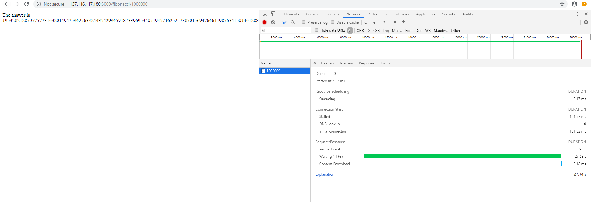
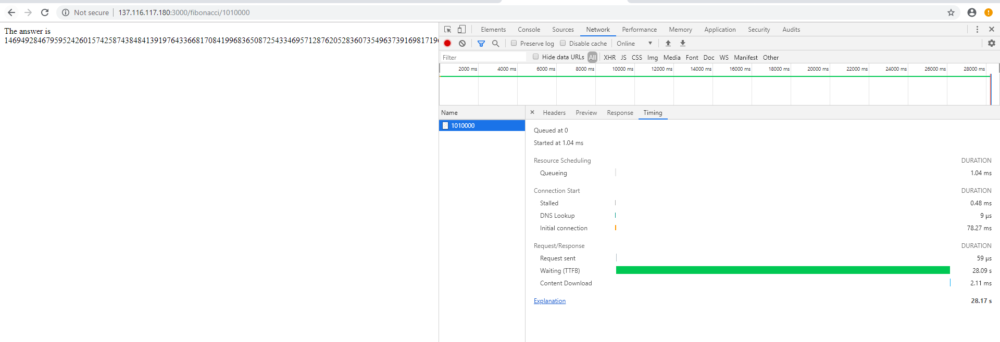
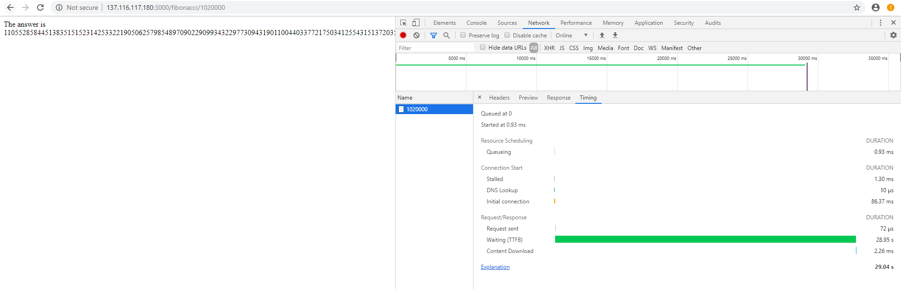
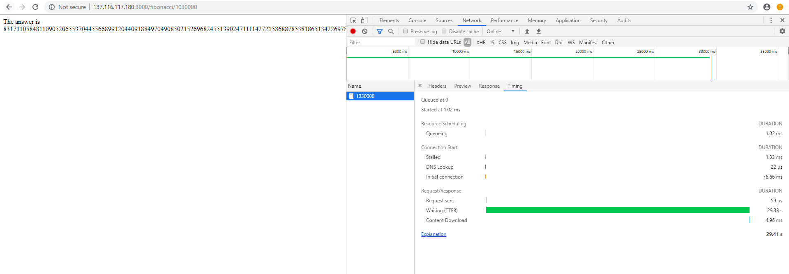
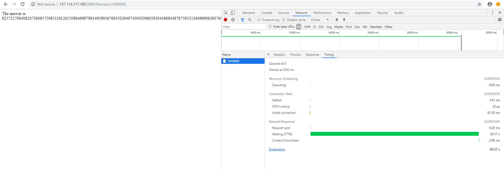
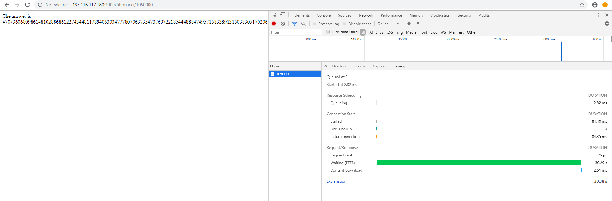
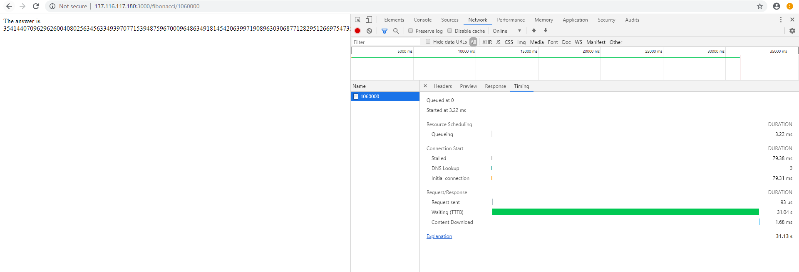
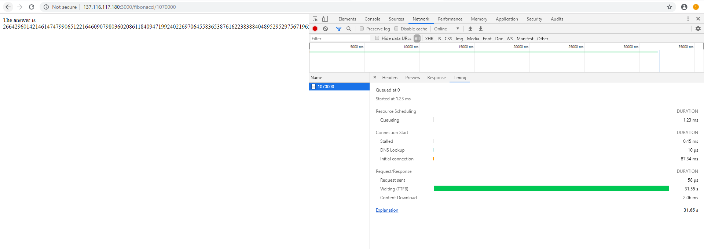
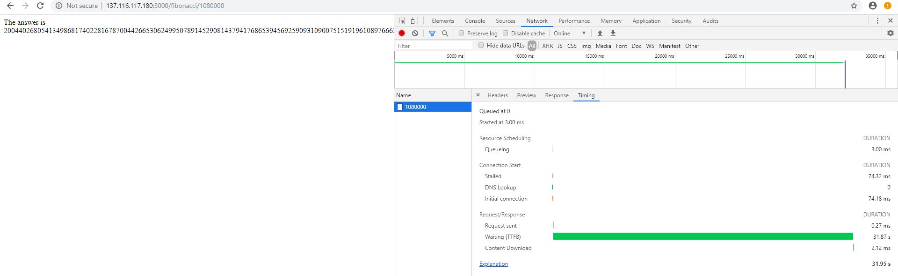
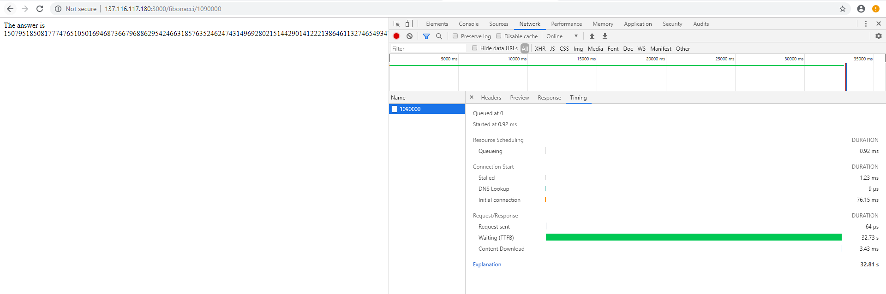

# Escalamiento en Azure con Maquinas Virtuales, Sacale Sets y Service Plans

## Tiempos de respuesta 

### 1000000

### 1010000

### 1020000

### 1030000

### 1040000

### 1050000

### 1060000

### 1070000

### 1080000

### 1090000

## Consumo de CPU 

# Autores 
- Luis Fernando Pizza Gamba https://github.com/luis572
- Diego Alejandro Corredor Tolosa https://github.com/diego2097
